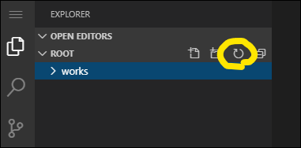

Start - [1](step1.md) - [2](step2.md) - [3](step3.md) - [4](step4.md) - [5](step5.md) - [6](step6.md) - [7](step7.md) - [8](step8.md) - [9](step9.md) - [**10**](step10.md) - [11](step11.md) - [12](step12.md) - End


# 課題5: 条件分岐を使う

本課題では、whenを使って特定の場合にだけ処理を実行するPlaybookを作る方法について学んでもらいます。  
題材として、特定の変数が定義されているターゲットにのみfetchを実行するPlaybookを作ります。

## 1. Playbookの作成

`playbook_kadai-5.yaml`に以下をコピペします。

```yaml
- hosts: all
  roles:
    - kadai-5
```

## 2. インベントリファイルに変数を定義

Step6で作成したインベントリファイルと同様の状態にしておいてください。

## 3. タスクの作成

[fetchモジュールのドキュメント](https://docs.ansible.com/ansible/2.9_ja/modules/fetch_module.html)と[条件のドキュメント](https://docs.ansible.com/ansible/2.9_ja/user_guide/playbooks_conditionals.html)を参考に、`roles/kadai-5/tasks/main.yaml`へタスクを作成します。  
実装の要件は以下の通りです。

* `fetch`モジュールを使うこと
* `server_location`の値が「豊洲」になっているターゲットサーバからのみ、`/etc/passwd`ファイルを取得すること
* 取得したファイルはカレントディレクトリ直下の`kadai-5_fetch_files`というディレクトリに配置すること

回答例は次のページに記載していますが、どうしても上手くいかない場合にだけ参考にしてください。

## 4. Playbookを実行

```bash
ansible-playbook -i inventory playbook_kadai-5.yaml
```

## 5. 取得したファイルの確認

Playbookを実行すると、カレントディレクトリ直下に`kadai-5_fetch_files`というディレクトリが表示されます。  
その中に`server_location: 豊洲`と記載したターゲットサーバ（＝2号機）から取得したファイルのみが入っていることを確認してください。  

※ディレクトリが表示されない場合は、エディタ上の以下の位置にある更新ボタンを押してください。



---

- [前のページに戻る](step9.md)
- [目次](README.md)
- [解説に進む](step10a.md)
